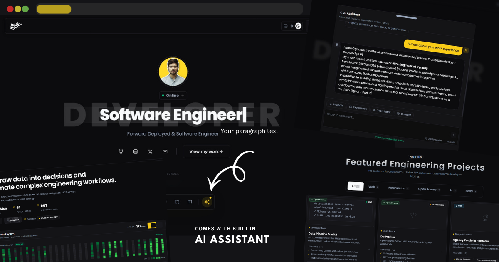

<div align="center">

# Portfolio Website

A modern, animated personal portfolio built with **Next.js 16**, **React 19**, **TypeScript**, and **Tailwind CSS v4**, featuring a Fumadocs-powered MDX blog, RAG-powered AI chatbot, GitHub contributions heatmap, and editorial-luxury design system.

[](https://bilalahmad.dev)
&nbsp;
[](https://github.com/Profysr/da-portfolio/stargazers)
&nbsp;
[](./LICENSE)
&nbsp;
[](https://nextjs.org/)
&nbsp;
[](https://react.dev/)
&nbsp;
[](https://www.typescriptlang.org/)
&nbsp;
[](https://tailwindcss.com/)
&nbsp;
[](https://fumadocs.vercel.app/)
&nbsp;
[](https://vercel.com)

<br />

[](https://bilalahmad.dev)

</div>

---

## Features

- **Next.js 16 App Router** with React 19 and TypeScript
- **Animated UI** using Motion (Framer Motion) and custom Tailwind keyframes
- **Fumadocs MDX blog** with syntax highlighting (Streamdown + Shiki), auto-generated TOC, and reading time
- **Projects portfolio** with detailed MDX pages, architecture diagrams, and terminal snippets
- **RAG-powered AI chatbot** with Groq primary → Google Gemini fallback, Upstash Vector storage
- **Live GitHub contributions** heatmap and stats via GitHub API
- **Editorial-luxury design system** with three-layer CSS token architecture (`@theme inline`)
- **Dark mode** by default via `next-themes`
- **Auto-generated sitemap, robots.txt, and dynamic OG images** for SEO
- **Vercel Analytics, Speed Insights, and Web Vitals** monitoring
- **WCAG AA accessible** — keyboard navigation, ARIA live regions, `prefers-reduced-motion` support

## Tech Stack

| | |
|---|---|
| **Framework** | Next.js 16 (App Router, Turbopack) + React 19 |
| **Language** | TypeScript |
| **Styling** | Tailwind CSS v4 — `@theme inline` namespace tokens |
| **Animation** | Motion (Framer Motion), custom Tailwind keyframes |
| **Content** | Fumadocs MDX + Streamdown@2.5 (Shiki highlighting) |
| **AI/Chat** | Groq `openai/gpt-oss-120b` primary · Google `gemini-2.0-flash` fallback · Upstash Vector RAG |
| **Integrations** | GitHub API (contributions heatmap) |
| **Analytics** | Vercel Analytics, Speed Insights, Web Vitals |
| **UI Primitives** | shadcn/ui (Radix + Tailwind), custom animated components |
| **Deploy** | Vercel (ISR, Edge runtime, Dynamic OG images) |

## Project Structure

```
app/
├── (home)/_components/      Hero · About · TechStack · Experience · Projects · Credentials · Writings · FAQ
├── (projects)/[...slug]/    ProjectContent · ReadingLayout · JSON-LD SoftwareApplication
├── (writing)/[...slug]/     WritingContent · ReadingLayout · JSON-LD Article · TOC
├── api/
│   ├── chat/route.ts        Edge runtime · Groq→Google fallback · Upstash Vector RAG · Zod guard
│   ├── github/route.ts      Vercel serverless · GitHub API with cache headers
│   └── revalidate/route.ts  ISR revalidation endpoint
├── lib/
│   ├── seo.ts               SEO metadata helpers (title, description, Open Graph, Twitter)
│   ├── structured-data.ts   JSON-LD structured data generators (Article, SoftwareApplication, Person, WebSite)
│   └── utils.ts             Utility functions
├── globals.css              @theme inline token wiring (colors, spacing, typography, effects)
├── layout.tsx               Root layout · Providers · Analytics · SpeedInsights · dual themeColor
├── providers.jsx            next-themes (class strategy · suppressHydrationWarning)
└── [og]/route.jsx           Dynamic OG images 1200×630 (3 templates)

components/
├── ui/                      shadcn primitives + animation/scroll engines
├── common/                  Tabs · Markdown · OptimizedImage · Skeleton · CodeBlock · ContentCarousel
├── chatbot/                 Chatbot · Message · QuickActions · ChatInputForm
├── docs/                    TableOfContents · DocsTopBar · SimilarContent · ZoomImage · Callout
├── layout/                  HomeLayout · TopBar · BottomDock · Footer · ReadingLayout · Section
└── *.jsx                    FavoriteStack · TechPill · AvatarStatus · Heatmap · StatCard · ContactCard

content/
├── projects/                Project MDX files (detail pages at /projects/{slug})
└── writings/                Blog MDX files (detail pages at /writing/{slug})

data/                        ← SINGLE SOURCE OF TRUTH for all content
├── idx.js                   Barrel export (re-exports everything)
├── types.ts                 TypeScript interfaces (Project, Writing, Experience, etc.)
├── personal.js              Name, bio, avatar, socials, website domain, about stats
├── navigation.js            Nav links, footer config, resume path
├── skills.js                TECH_ICON_MAP (all tool icons), SkillsAndTools (TechStack categories), favoriteStack
├── experience.js            Work experience entries (company, roles, skills, dates)
├── projects.js              Project index entries (slug, title, tech, tags, features, etc.)
├── writings.js              Writing index entries (slug, title, excerpt, date, category, etc.)
├── credentials.js           Education, awards, certificates
├── content.js               Misc content (hero tagline, CTA, etc.)
└── botContent.js            Chatbot knowledge base / system prompt additions
```

## Getting Started

```bash
# install dependencies
npm install

# run the development server (http://localhost:3000)
npm run dev

# build for production (runs fumadocs-mdx first)
npm run build

# run the production build
npm start

# lint
npm run lint

# build vector index for RAG chatbot (uploads content to Upstash Vector)
npm run build:index
```

Copy `.env.example` to `.env.local` and fill in the keys you want. The site runs without them; the live widgets (GitHub, Chatbot) just fall back to placeholder data until keys are set.

### Required Environment Variables

| Variable | Description | Required For |
|---|---|---|
| `DATABASE_URL` | PostgreSQL connection (Vercel Postgres / Neon) | Chat history persistence |
| `GROQ_API_KEY` | Groq API key | AI Chatbot (primary) |
| `GOOGLE_GENERATIVE_AI_API_KEY` | Google AI Studio key | AI Chatbot (fallback) |
| `UPSTASH_VECTOR_REST_URL` | Upstash Vector database URL | RAG embeddings storage |
| `UPSTASH_VECTOR_REST_TOKEN` | Upstash Vector auth token | RAG embeddings storage |
| `UPLOADTHING_SECRET` | UploadThing secret | File uploads in chat |
| `UPLOADTHING_APP_ID` | UploadThing app ID | File uploads in chat |
| `GITHUB_TOKEN` | GitHub personal access token | Contributions heatmap |
| `GITHUB_USERNAME` | Your GitHub username | Contributions heatmap |

### Building the Vector Index (RAG Chatbot)

The chatbot uses **Upstash Vector** for Retrieval-Augmented Generation (RAG). You must build the vector index after adding/updating content:

```bash
# Requires UPSTASH_VECTOR_REST_URL and UPSTASH_VECTOR_REST_TOKEN in .env.local
npm run build:index
```

**What `npm run build:index` does** (`scripts/build-index.js`):

1. **Resets** the Upstash Vector index (clears existing vectors)
2. **Chunks and indexes** content from all data sources:
   - **Projects & Writings MDX files** — parses frontmatter + body, splits by headings/paragraphs
   - **Experience** — roles, descriptions, skills from `data/experience.js`
   - **Skills & Tools** — categories and items from `data/skills.js`
   - **Credentials** — education, awards, certificates from `data/credentials.js`
   - **Bot Knowledge** — custom profile facts from `data/botContent.js`
   - **Project/Writing index entries** — summaries from `data/projects.js` and `data/writings.js`
3. **Upserts in batches** of 100 vectors with metadata (URL, title, heading, category)
4. **Uses Upstash's built-in embedding model** (no external embedding API needed)

**When to run it:**
- After adding new projects/writings (both data file + MDX)
- After updating experience, skills, credentials, or bot knowledge
- After changing chunking logic in `scripts/build-index.js`
- On first deploy (CI/CD should run it)

**Requirements:**
- `UPSTASH_VECTOR_REST_URL` and `UPSTASH_VECTOR_REST_TOKEN` in `.env.local`
- Upstash Vector index created (free tier works)
- The index uses Upstash's **model-based indexing** — embeddings generated server-side

---

## Making It Yours (Complete Guide)

This project uses **`data/` as the single source of truth** for all content. Components read from these files — you rarely need to edit components directly.

### 1. Your Identity & Social: `data/personal.js`

```js
export const personal = {
  name: "Your Name",
  tagline: "Your Title / Tagline",
  bio: `Your bio here...`,
  avatar: "/avatar.jpg",           // Place in public/
  logo: "/sig.png",                // Your signature/logo in public/
  location: "Your Country",
  locationLabel: "City, Country → Worldwide",
  timezone: "GMT+X",               // For avatar status chip
  githubUsername: "YourGitHub",    // For GitHub heatmap
  email: "you@example.com",
  resumeUrl: "/Resume Your Name.pdf",  // Place in public/
  socials: [ /* array of { platform, icon, url, label, handle, aria, color, hoverColor } */ ],
};
```

Update `avatar.jpg`, `sig.png`, and resume PDF in `public/`.

### 2. Navigation & Footer: `data/navigation.js`

```js
export const nav = [
  { id: "hero", label: "Home", icon: IconHome },
  { id: "about", label: "About", icon: IconUser },
  { id: "experience", label: "Experience", icon: IconBriefcase },
  { id: "projects", label: "Projects", icon: IconFolderCode },
  { id: "writings", label: "Writings", icon: IconBook },
];

export const footer = {
  badge: "Get in Touch",
  heading: "Your footer heading",
  subheading: "Your tagline",
  ctaLabel: "Say Hello",
  resumePath: "/Resume Your Name.pdf",
};
```

### 3. Experience Timeline: `data/experience.js`

```js
export const experiences = [
  {
    company: "Company Name",
    url: "https://company.com",
    location: "City, Country",
    locationType: "Remote | Hybrid | Onsite",
    isCurrent: true,
    roles: [
      {
        id: "unique-id",
        title: "Your Title",
        type: "Full-time | Contract | Internship",
        startDate: "YYYY-MM",
        endDate: null, // or "YYYY-MM"
        description: "What you did...",
        skills: ["Tech1", "Tech2", ...],
      },
    ],
  },
];
```

### 4. Projects Portfolio: `data/projects.js` + `content/projects/`

**Two-step process** — the index entry in `projects.js` drives the grid/cards, and the MDX file drives the detail page.

#### Step A: Add entry to `data/projects.js`

```js
export const projects = [
  {
    id: "proj-unique",
    slug: "your-project-slug",        // MUST match MDX filename exactly
    title: "Project Title",
    description: "Short description for cards",
    tech: ["React", "TypeScript", ...],
    tags: ["Web", "Open Source"],     // Must exist in TAG_META
    industry: "Industry Name",        // or null
    access: "Open Source | Private | Hosted",
    status: "live | in-progress",
    features: ["Feature 1", "Feature 2"],
    strategies: ["Strategy 1", "Strategy 2"],
    github: "https://github.com/...", // or null
    live: "https://demo.com",         // or null
    image: null,                      // Full-size image for detail page
    thumbnail: null,                  // Card thumbnail
    featured: true,                   // Shows in hero/featured section
    isActivity: false,                // True = shows in "Activity" tab
    link: null,                       // External link (if isExternal: true)
    isExternal: false,
    tag: "Web",                       // Primary tag for Activity view
    terminalSnippet: "command output", // Optional terminal demo
    archDiagram: {                    // Optional architecture diagram
      label: "System Architecture",
      nodes: ["Node A", "Node B", "Node C"],
    },
  },
];
```

#### Step B: Create `content/projects/your-project-slug.mdx`

```mdx
---
title: "Project Title"
description: "Short description for SEO/social"
date: "2026-01-15"
tags: ["React", "TypeScript"]
image: "/projects/your-project-cover.jpg"
---

Your detailed project writeup in **MDX**. 

## Architecture

### Component Breakdown

Code blocks get syntax highlighting automatically.

```typescript
// Your code here
```
```

> **Critical:** The MDX filename (`your-project-slug.mdx`) must **exactly match** the `slug` field in `projects.js`. This is how Fumadocs routes to the detail page at `/projects/your-project-slug`.

### 5. Writings / Blog: `data/writings.js` + `content/writings/`

Same two-step pattern as projects.

#### Step A: Add entry to `data/writings.js`

```js
export const writings = [
  {
    id: "blog-unique",
    slug: "your-post-slug",           // MUST match MDX filename exactly
    title: "Your Post Title",
    excerpt: "One-line preview for cards",
    description: "SEO description",
    date: "2026-01-15",
    tags: ["Next.js", "React"],
    readTime: "8 min",
    image: "/writings/your-cover.jpg",     // Cover for detail page
    thumbnail: "/writings/your-thumb.jpg", // Card thumbnail
    category: "Category Name",
  },
];
```

#### Step B: Create `content/writings/your-post-slug.mdx`

```mdx
---
title: "Your Post Title"
description: "SEO description"
date: "2026-01-15"
tags: ["Next.js", "React"]
image: "/writings/your-cover.jpg"
thumbnail: "/writings/your-thumb.jpg"
category: "Category Name"
---

Your article content in **MDX**.
```

> **Critical:** MDX filename must **exactly match** the `slug` in `writings.js`. Route: `/writing/your-post-slug`.

### 6. Skills & Tech Stack: `data/skills.js`

All tool icons live in `TECH_ICON_MAP` — single source of truth for every `TechPill` rendered anywhere.

```js
export const TECH_ICON_MAP = {
  "Your Tool": { img: "/tools/your-tool.svg", category: "Frontend" },
  // If no icon exists, omit `img` — TechPill shows name only (no fallback icons)
};

export const SkillsAndTools = [
  {
    category: "Your Category",
    Icon: IconCpu,           // From @tabler/icons-react
    shade: "shade-card-blue", // CSS shade class from globals.css
    items: [
      { name: "Your Tool", subCategory: "Frontend" },
    ],
  },
];

export const favoriteStack = {
  title: "Core Powerhouse",
  subtitle: "Daily Drivers",
  stack: "Tool1 • Tool2 • Tool3",
  tag: "Your Stack Label",
  items: [
    { name: "Tool1", role: "Category" },
  ],
};
```

Add new tool SVGs to `public/tools/` (naming: `tool-name.svg`, `tool-name-dark.svg` for dark mode).

### 7. Credentials: `data/credentials.js`

```js
export const education = [
  {
    id: "edu-unique",
    institution: "University Name",
    degree: "Bachelor of Science",
    fieldOfStudy: "Computer Science",
    minor: "Mathematics",
    startDate: "2020",
    endDate: "2024",
    grade: "3.8 GPA",
    activities: "Clubs, labs",
    description: "Focus areas...",
    location: "City, Country",
    skills: ["C++", "Python", ...],
    url: "https://university.edu",
    image: "/experience/logo.jpg", // Place in public/experience/
  },
];

// Awards & certificates are defined but not rendered by default.
// Enable in Credentials.jsx if needed.
```

### 8. Chatbot Knowledge: `data/botContent.js`

Add domain-specific knowledge for the RAG chatbot:

```js
export const botContent = `
## Your Custom Knowledge
- Fact 1 about you
- Fact 2 about your work
- Technical preferences
`;
```

### 9. SEO Configuration

| File | Purpose |
|---|---|
| `app/lib/seo.ts` | Centralized SEO helpers: `generateMetadata()`, `generateArticleMetadata()`, `generateProjectMetadata()` — generates title, description, Open Graph, Twitter cards |
| `app/lib/structured-data.ts` | JSON-LD generators: `Article`, `SoftwareApplication`, `Person`, `WebSite`, `BreadcrumbList` |
| `app/layout.tsx` | Root metadata, `metadataBase`, site name, default Open Graph |
| `app/sitemap.ts` | Auto-generates sitemap.xml from all routes |
| `app/robots.ts` | Auto-generates robots.txt |
| `app/[og]/route.jsx` | Dynamic OG image generation (3 templates) |

**To customize SEO:** Update `metadataBase` in `app/layout.tsx` to your domain, and edit `personal.js` `websiteDomain`. The SEO helpers pull from your data files automatically.

### 10. Design Tokens: `app/globals.css`

The entire design system uses `@theme inline` CSS tokens:

```css
@theme inline {
  /* Colors — semantic light/dark maps */
  --color-bg: #FDFBF7;
  --color-bg-dark: #1a1a1a;
  --color-gold: #EBC429;
  /* ... */

  /* Typography — fluid clamp scale */
  --font-stack-sans: "Geist", sans-serif;
  --font-stack-mono: "Geist Mono", monospace;
  --text-*: clamp(...);

  /* Spacing — rhythm & radius */
  --radius: 4px;
  --space-section: clamp(...);

  /* Effects — shadows, easings, spotlights */
  --shadow-e1: ...;
  --ease-*: ...;
}
```

Edit `globals.css` to rebrand: change color palette, typography scale, spacing rhythm, shadows. The "taste profile" is editorial-luxury: warm cream `#FDFBF7`, gold accent `#EBC429`, reverse-animated entrances, lower roundness, tighter spacing, multi-hue tint system for card categories.

### 11. Images & Assets

| What | Location |
|---|---|
| Avatar / profile | `public/avatar.jpg` |
| Signature / logo | `public/sig.png` |
| Resume PDF | `public/Resume Your Name.pdf` |
| Project covers/thumbnails | `public/projects/` |
| Writing covers/thumbnails | `public/writings/` |
| Experience logos | `public/experience/` |
| Tool icons | `public/tools/` (SVG, add `-dark` variant for dark mode) |
| Favicon / manifest | `public/` |
| OG templates | `app/[og]/route.jsx` |

---

## Quick Checklist for Forking

- [ ] Update `data/personal.js` — name, bio, avatar, socials, GitHub username, domain
- [ ] Update `data/navigation.js` — nav links, footer, resume path
- [ ] Replace `data/experience.js` — your work history
- [ ] Replace `data/projects.js` + create matching MDX files in `content/projects/`
- [ ] Replace `data/writings.js` + create matching MDX files in `content/writings/`
- [ ] Update `data/skills.js` — your `TECH_ICON_MAP`, `SkillsAndTools`, `favoriteStack`
- [ ] Update `data/credentials.js` — your education, awards, certificates
- [ ] Update `data/botContent.js` — chatbot knowledge
- [ ] Swap images in `public/` (avatar, logos, covers, tool icons)
- [ ] Edit `app/globals.css` — your brand colors, typography, spacing
- [ ] Update `app/layout.tsx` — `metadataBase`, site name, domain
- [ ] Update `app/sitemap.ts`, `app/robots.ts`, `app/[og]/route.jsx` — domain
- [ ] Add `.env.local` with your API keys
- [ ] Update this `README.md` and `LICENSE`/`NOTICE` attribution

---

## Support

Building and maintaining this in the open takes real time. If the code was useful, you learned something, or you used it as a starting point:

- **Star the repo.** It is the simplest way to say thanks and helps others find it.
- **Fork it** and build your own version (see the license terms below).
- Found a bug or have an idea? [Open an issue](https://github.com/Profysr/da-portfolio/issues). Feedback is welcome.

## License and Usage

Please read this before reusing anything. This repository is **Apache License 2.0** (see [`LICENSE`](./LICENSE) for the full text):

- **The code is Apache-2.0-licensed.** You are welcome to read it, learn from it, and fork it to build your own portfolio.
- **The personal content is All Rights Reserved.** My name, bio, photos, logo, blog posts, project write-ups, and other curated assets are not covered by the Apache license and may not be reused.

If you build on this code, please:

1. Replace all of my personal content with your own.
2. Don't present this site (or a substantially similar copy) as your own work.
3. Keep the [`LICENSE`](./LICENSE) and [`NOTICE`](./NOTICE) files as Apache 2.0 requires, preserve the attribution they contain, and note any files you changed. A link back to this repo or [my GitHub](https://github.com/Profysr) is appreciated.

If you want to use it in a way the license does not cover, [open an issue](https://github.com/Profysr/da-portfolio/issues) and ask. Happy to chat.

---

<div align="center">

Made by [Bilal Ahmad](https://github.com/Profysr).

</div>
